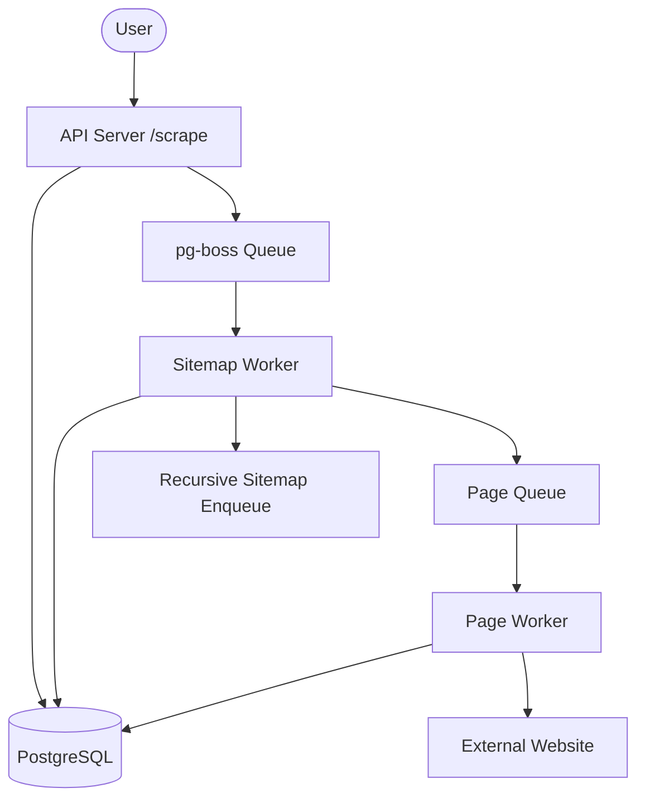

# Architecture Overview

The Web Scraper project is a distributed, event-driven system designed to handle large-scale sitemap processing and page scraping efficiently.

## System Structure

## Module Breakdown

- **`src/api/`**: Contains the `Bun.serve` server that accepts scraping requests.
- **`src/db/`**: Handles the database schema definition using Drizzle ORM and provides a central database client.
- **`src/queue/`**: Manages the `pg-boss` queue system for asynchronous job processing.
- **`src/scraper/`**: Core scraping logic.
  - `worker.ts`: Defines the `sitemap_queue` and `page_queue` handlers.
  - `extractor.ts`: Contains logic for stripping HTML tags and extracting textual content.
- **`src/utils/`**: Shared utilities like logging, configuration management, and database cleanup scripts.

## Data Flow / Request Lifecycle

1.  **Submission:** The user sends a POST request to `/scrape` with a sitemap URL.
2.  **Initialization:** The API server creates a root sitemap record in the `sitemaps` table and enqueues a job in `sitemap_queue`.
3.  **Sitemap Traversal:**
    - The `Sitemap Worker` fetches the XML sitemap.
    - If it's a **Sitemap Index**, it identifies child sitemaps and enqueues them back into `sitemap_queue`.
    - If it's a **URL Set**, it identifies page URLs and enqueues them into `page_queue`.
    - It uses the `root_id` to link all children back to the original request.
4.  **Page Scraping:**
    - The `Page Worker` picks up jobs from `page_queue`.
    - It fetches the HTML content of the page.
    - It uses the `extractor` to clean the HTML and extract text.
    - It updates the `urls` table with the extracted content and sets the status to `done`.
5.  **Status Tracking:** The user can track progress by querying the `urls` table for a specific `root_id`.

## Key Design Decisions

- **pg-boss for Queuing:** Chosen for its simplicity and reliability using PostgreSQL as a backend, avoiding the need for Redis.
- **Drizzle ORM:** Provides type-safe SQL queries and easy-to-manage migrations.
- **rootId Tracking:** Added to allow efficient querying of an entire sitemap's progress without expensive recursive SQL joins.
- **Conditional Re-scraping:** Uses the `lastmod` field from sitemaps to prevent re-scraping unchanged content, saving bandwidth and processing power.
- **Separate Workers:** The architecture separates the API from the workers, allowing each component to be scaled independently.

## External Dependencies

- **Bun:** High-performance runtime for executing the project.
- **PostgreSQL:** Primary storage for sitemaps, URLs, and queue data.
- **pg-boss:** Background job processing library.
- **Drizzle ORM:** TypeScript ORM for database interactions.
- **axios:** For fetching sitemaps and web pages.
- **cheerio:** For parsing and cleaning HTML content.
- **xml2js:** For parsing XML sitemap data.
