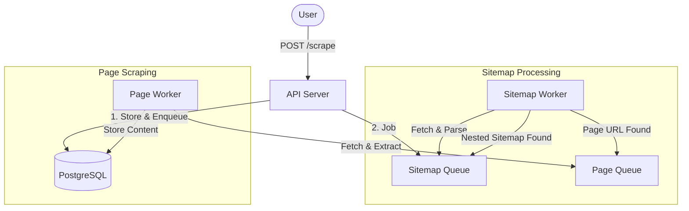

# Web Scraper Project Overview

An automated, distributed web scraping system that crawls websites by recursively discovering URLs through XML sitemaps.

## What It Does
This system takes a root sitemap URL, navigates through the entire sitemap hierarchy (including nested indices), and enqueues every discovered page for content extraction. It is designed to be highly scalable, using a queue-based architecture to process thousands of URLs in parallel.

## High-Level Flow

### Simple Step-by-Step
1. **Trigger**: You send a sitemap URL to the API.
2. **Discovery**: The Sitemap Worker fetches the XML, finds all sub-sitemaps (indices), and repeats this until every individual page URL is found.
3. **Extraction**: Every discovered page URL is sent to a separate queue.
4. **Processing**: Page Workers pick up these URLs, download the HTML, extract the relevant content, and save it to the database.
