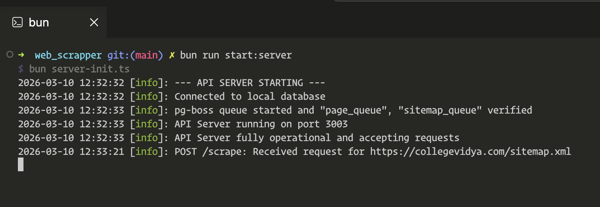
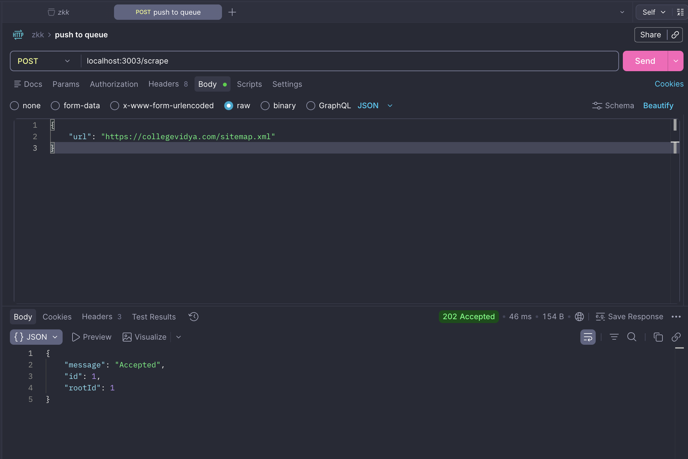
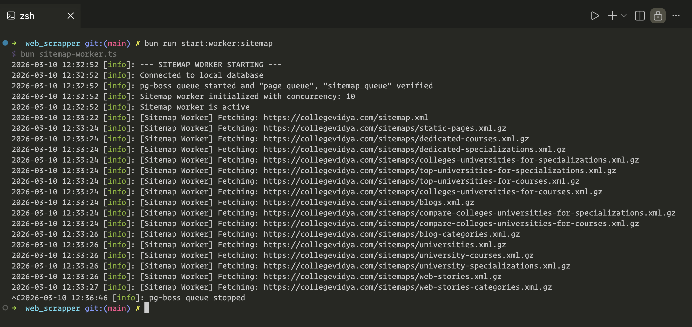
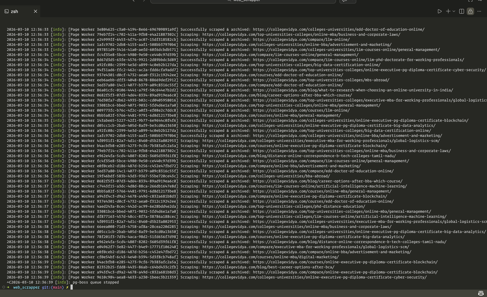
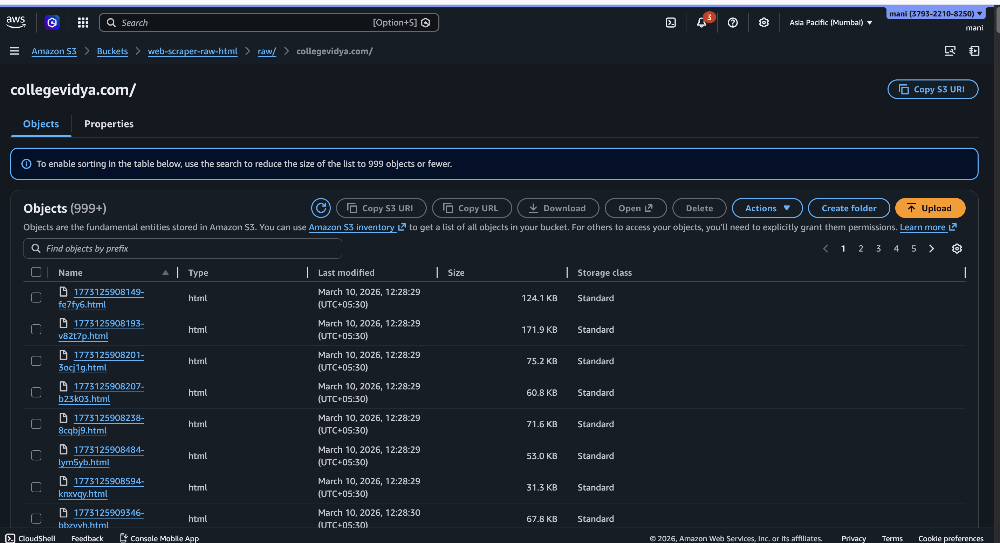
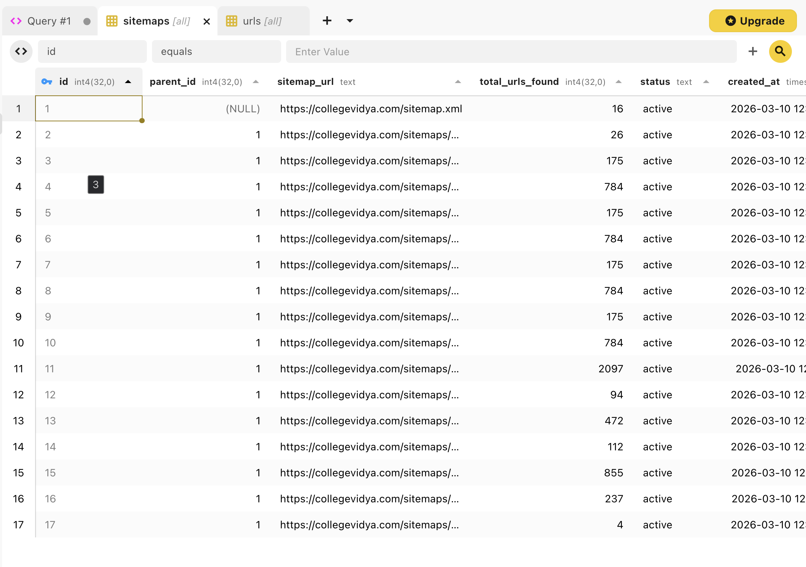
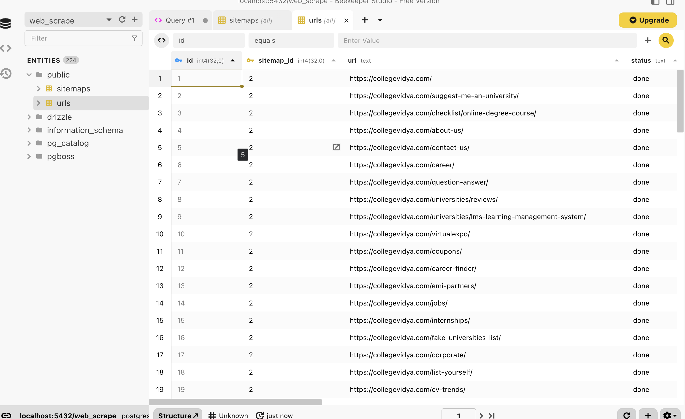
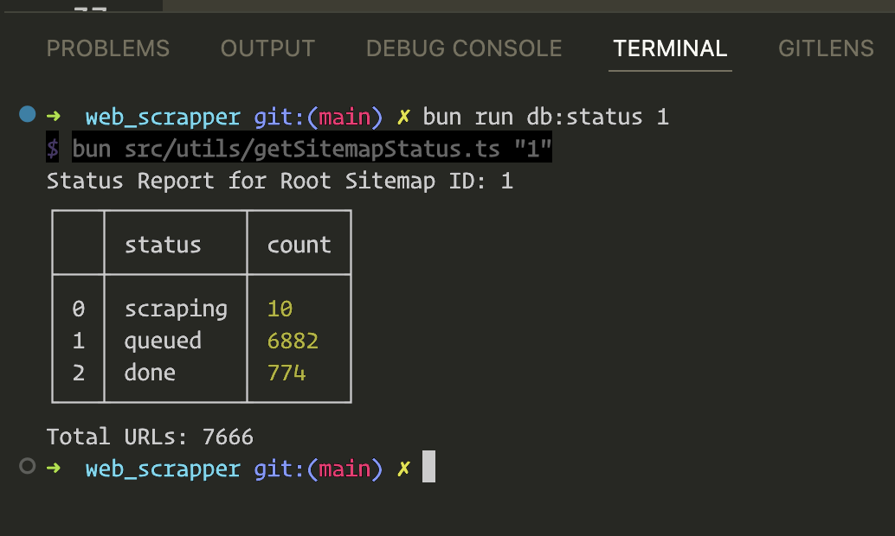

# Distributed Web Scraper

High-performance, async sitemap and page content scraper built with Bun, TypeScript, and PostgreSQL.

### Core Features
- **Async & Non-Blocking:** Fully event-driven using `pg-boss` (Postgres) as the queue engine.
- **S3 Archival:** Automatically uploads raw HTML to S3 for permanent storage and auditing.
- **Markdown Conversion:** Transforms complex HTML into clean, structured Markdown, preserving document hierarchy for better LLM ingestion.
- **Smart Re-Scraping:** Uses `lastmod` tracking to only re-process updated pages, saving bandwidth.
- **Zero Duplicates:** Strict `ON CONFLICT` logic ensures no redundant sitemap or URL records.
- **Hierarchical Tracking:** Uses `root_id` to instantly track progress of any top-level sitemap request.
- **Dual-Queue System:** Separate queues for Sitemaps and Pages to manage concurrency independently.
- **Recursion Safety:** Configurable `depth` limit to prevent infinite sitemap loops.
- **Status CLI:** Built-in tool to track URL discovery and scraping progress in real-time.

### Visual Overview

#### 1. API Server Initialization

*The API server initializes the database connection and the pg-boss queue.*

#### 2. Triggering a Scrape (Postman)

*Submit any sitemap URL to the `/scrape` endpoint to start the distributed process.*

#### 3. Sitemap Worker in Action

*The sitemap worker recursively traverses nested indices and enqueues discovery jobs.*

#### 4. Page Scraper Worker

*Individual page workers download, archive to S3, and convert HTML to clean Markdown.*

#### 5. S3 Archival Storage

*Raw HTML is stored in S3 for permanent auditing and data integrity.*

#### 6. Database Status (Sitemaps)

*Tracking sitemap processing status and total discovery counts.*

#### 7. Database Status (URLs)

*The final state of scraped URLs including S3 links and content status.*

#### 8. Progress Tracking CLI

*Instantly monitor the progress of a specific root sitemap discovery.*

### Documentation
- [Architecture](ARCHITECTURE.md) | [Setup](SETUP.md) | [Database](DB.md) | [API](API.md)
