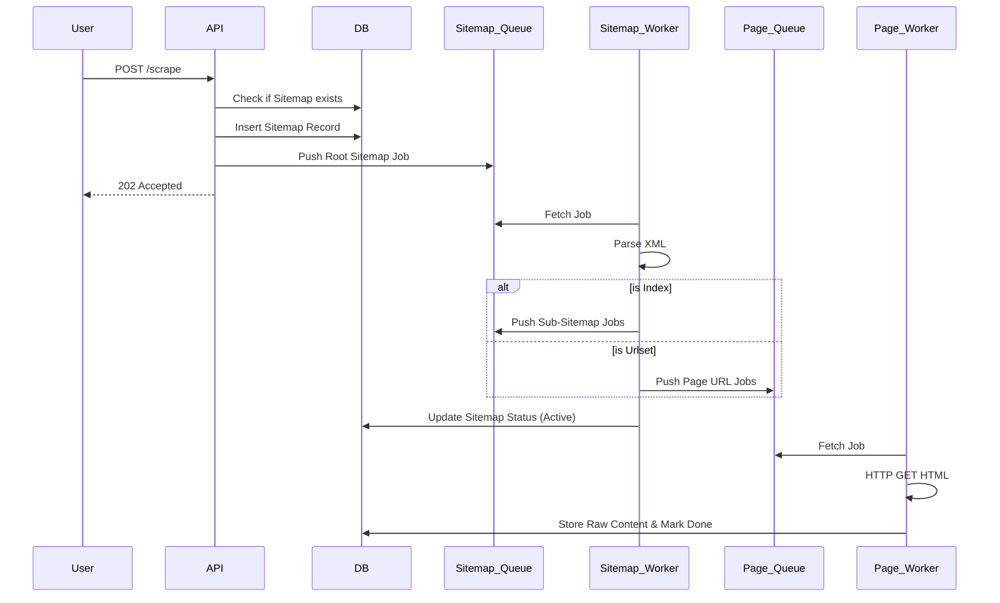

# System Architecture: Distributed Web Scraper

This document explains the technical inner workings of the system and how the components interact to provide a scalable scraping solution.

## Architecture Pattern
The system follows a **Distributed Worker (Producer/Consumer)** pattern. It decouples the discovery of sitemap data from the actual scraping of page content to ensure that a slow website or a massive sitemap does not block the entire process.

---

## Core Components

### 1. API Server (`server-init.ts`)
The entry point of the system.
- **Responsibility**: Accepts a root sitemap URL from a user, performs initial database checks, and enqueues the first job into the `sitemap_queue`.
- **Async Response**: Returns an immediate `202 Accepted` to the user so they don't have to wait for the crawl to finish.

### 2. Sitemap Worker (`sitemap-worker.ts`)
The discovery engine.
- **Responsibility**: 
    - Fetches XML sitemaps.
    - Differentiates between a Sitemap Index (links to other XML files) and a Urlset (links to HTML pages).
    - **Recursion**: If it finds a sub-sitemap, it adds a new job to its own queue (`sitemap_queue`).
    - **Dispatch**: If it finds a page URL, it adds a job to the `page_queue`.
- **Concurrency**: Can be scaled to run multiple instances to handle sitemaps from different domains simultaneously.

### 3. Page Worker (`page-worker.ts`)
The content extractor.
- **Responsibility**:
    - Fetches the actual HTML from the discovered URLs.
    - Extracts meaningful text or raw content.
    - Updates the URL status in the database to `done`, `scraping`, or `failed`.
- **High Concurrency**: This is usually the bottleneck, so this worker is designed to run with higher concurrency (many workers scraping different pages in parallel).

---

## Data Model & Queues

### Database (Drizzle + PostgreSQL)
- **`sitemaps` Table**: Tracks the discovery hierarchy (`parentId`), discovery status, and total URLs found.
- **`urls` Table**: Stores the individual page URLs, their scraping status, and the extracted content.

### Queues (pg-boss)
We use `pg-boss` because it's built on PostgreSQL, meaning we don't need a separate Redis instance. It provides:
- **Retries**: Automatic retries if a network request fails.
- **Isolation**: Each worker operates in its own process, preventing one crash from taking down the whole system.
- **Distributed Lock**: Ensures that the same URL isn't processed by two workers at the exact same time.

---

## Technical Flow Diagram

